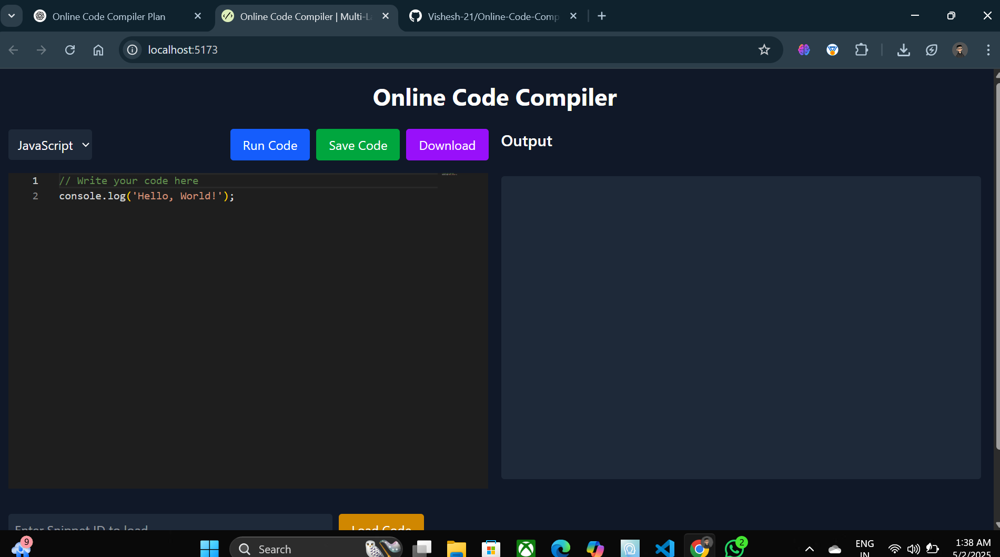

## Online Code Compiler

A lightweight, accessible, multi-language online code compiler designed for developers, students, and hobbyists. This project allows real-time code execution across devices without the need for heavy IDEs or OS dependencies.

## Table of Contents

Features
Prerequisites
Installation
Usage
Project Structure
API Endpoints
Contributing
Contact
Features

---

## Features

1. Supports multiple programming languages: JavaScript, Python, C++, Java, and HTML.
2. Real-time code execution with output display in the browser.
3. Responsive and intuitive UI/UX optimized for desktop and mobile devices.
4. Session management to save and share code snippets.
5. Code downloading capability.
6. Fast compilation with minimal backend latency using the JDoodle API.
7. Scalable and secure design.
8. Real-time code execution with output display in the browser.
9. Responsive and intuitive UI/UX optimized for desktop and mobile devices.
10. Session management to save and share code snippets.
11. Code downloading capability.
12. Fast compilation with minimal backend latency using the JDoodle API.

## Prerequisites

Node.js (v16.x or later)

npm (comes with Node.js)

A JDoodle API account (for code execution) - Sign up at JDoodle

---

## Installation

1. Clone the Repository
   git clone https://github.com/Vishesh-21/Online-Code-Compiler-Multi-Language-Realtime-Code-Runner

2. Backend Setup

   1. Navigate to the backend directory:

      cd backend

   2. Install dependencies:

      npm install

   3. Create a .env file in the backend directory and add your JDoodle credentials:

      JDOODLE_CLIENT_ID=your_jdoodle_client_id
      JDOODLE_CLIENT_SECRET=your_jdoodle_client_secret

   4. Start the backend server:

      node server.js

3. Frontend Setup

   1. Navigate to the frontend directory:

      cd frontend

   2. Install dependencies:

      npm install

   3. Start the React application:

      npm run dev

---

## Usage

0. Select a programming language from the dropdown.
1. Open your browser and go to http://localhost:3000.
2. Write or paste your code in the editor.
3. Click "Run Code" to execute and see the output.
4. Save your code by clicking "Save Code" to get a unique snippet ID.
5. Share the snippet ID with others or load it using the "Load Code" feature.
6. Download your code by clicking "Download".

---

## API Endpoints

1. POST /api/execute: Proxy to JDoodle API for code execution.
   Body: { script: string, language: string, versionIndex: string }
   Response: { output: string, error: string }

2. POST /api/snippets: Save a code snippet.
   Body: { code: string, language: string }
   Response: { id: number }

3. GET /api/snippets/:id: Load a code snippet by ID.
   Response: { code: string, language: string } or { error: string }

---

## ScreenShot

## Contributing

1. Fork the repository.
2. Create a new branch (git checkout -b feature-branch).
3. Make your changes and commit them (git commit -m "Add new feature").
4. Push to the branch (git push origin feature-branch).
5. Open a pull request.

---

## Contact

For questions or support, contact visheshbaund@gmail.com or open an issue on the GitHub repository.
